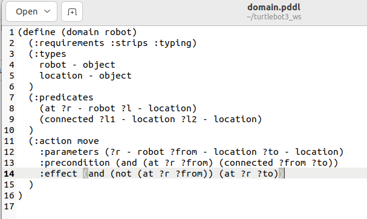
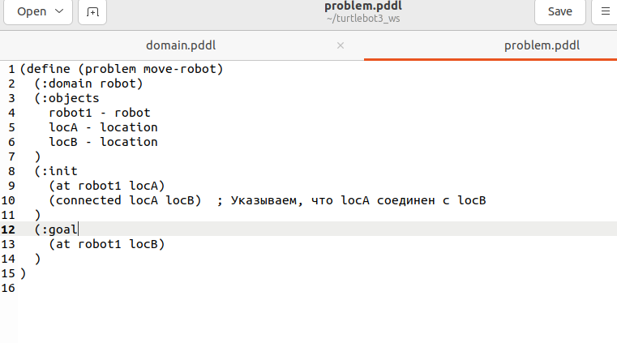
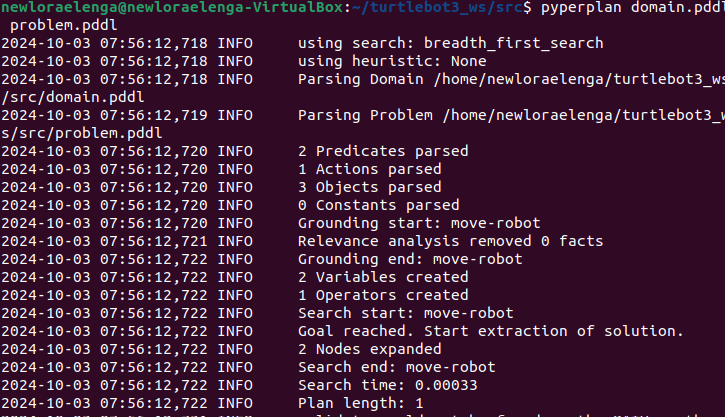
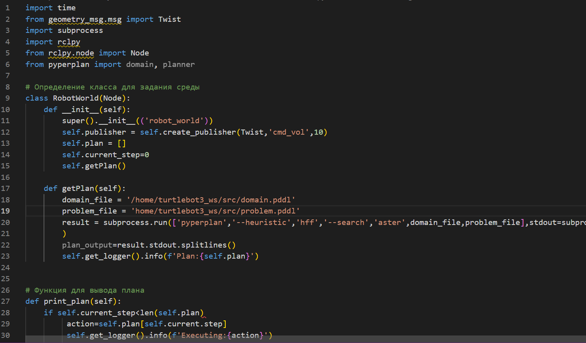
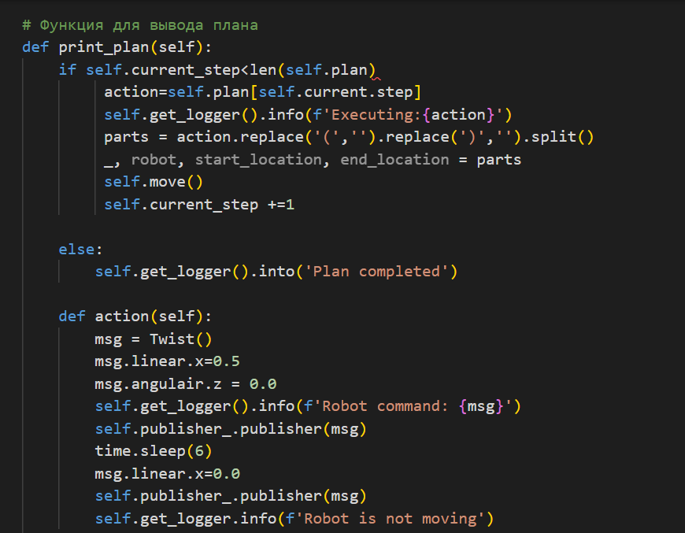
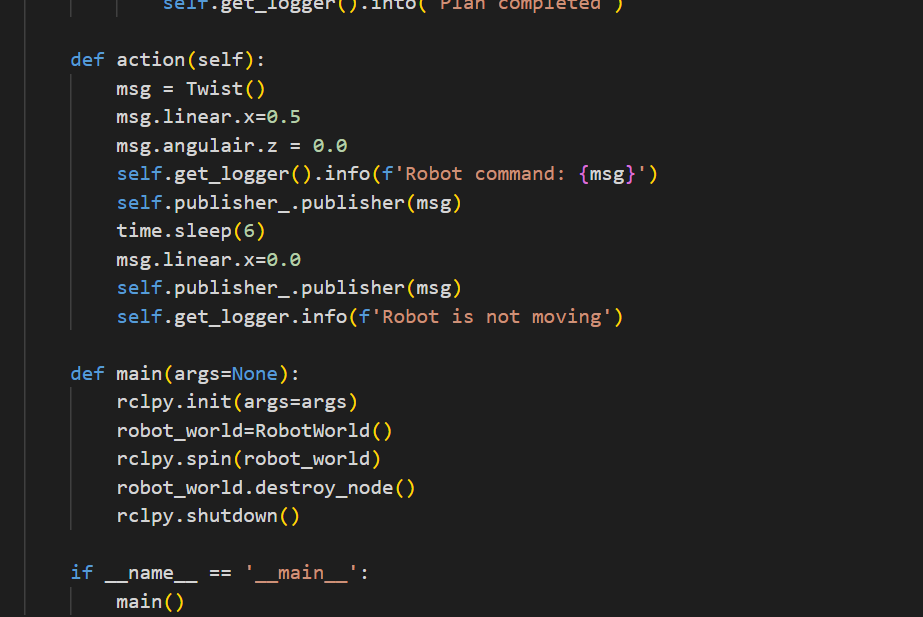
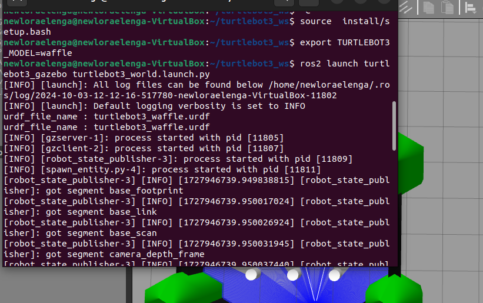
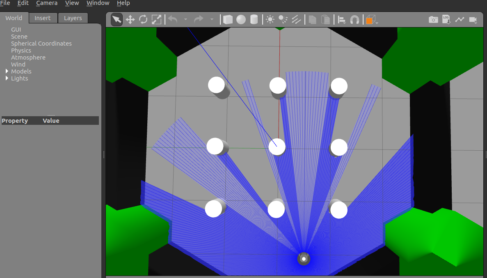

# ЯПИИ 2024
## Лабораторная работа 2
#### Студент: Еленга Невлора Люглеш
#### Ст: 1032245779
#### Группа:НПИмд-01-24

### Задачи: 

. Использовать 1 из алгоритмов планирования для передвижения робототехнического агента из точки А в точку В
. Изучить отличие сплайнового метода построения пути от классических алгоритмов

### Выполнение

- Использовать 1 из алгоритмов планирования для передвижения робототехнического агента из точки А в точку В

1. Определение проблемы планирования
  - создали два файла: `domain.pddl` для описания домена и `problem.pddl` для описания задачи.

{#fig:001 width=70%}
{#fig:001 width=70%}

2. Запуск планировщика:
 - Использовали `pyperplan` для запуска планировщика на основе созданного PDDL

{#fig:002 width=70%}

{#fig:003 width=70%}

{#fig:004 width=70%}

{#fig:005 width=70%}

{#fig:006 width=70%}

{#fig:006 width=70%}

- Изучили отличие сплайнового метода построения пути от классических алгоритмов

3. Построение пути с помощью сплайнов

Создали систему, которая будет управлять передвижением ы робототехнического агента из точки A в точку B, используя STRIPS для планирования и сплайн-методы для построения пути.

